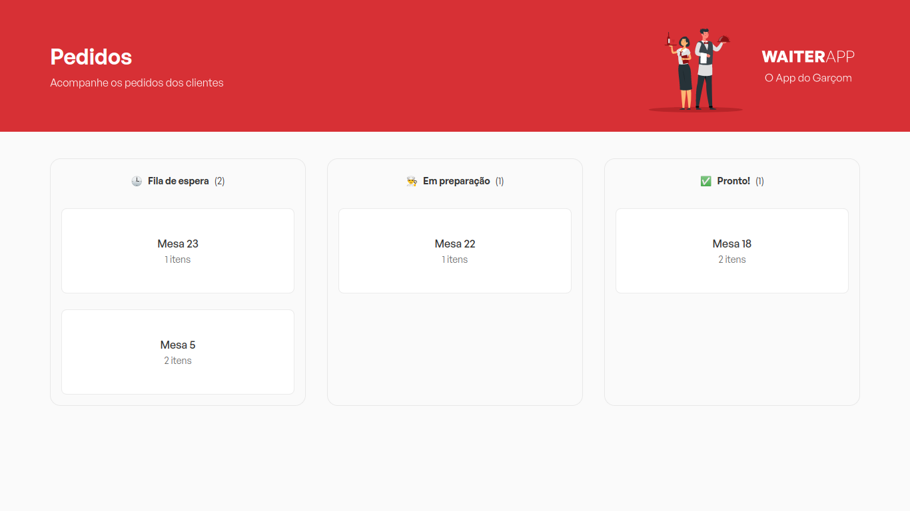

# 👨‍🍳 Waiter App


> Projeto feito durante um evento online do [Mateus Silva](https://www.instagram.com/imateus.silva/), chamado O Poder do Javascript. O projeto consiste em um app mobile e web para gerenciar pedidos de um restaurante.

## 🖥️ Versão Web

O dashboard da cozinha controla quais pedidos estão sendo preparados e quais foram finalizados.



## 📱 Versão Mobile

A versão mobile é responsável por pegar os pedidos do cliente e enviar as informações para o dashboard da cozinha.

<span></span>
<span></span>

## 🛠️ Techs

<div>
  
  
  
  
  
  
  
</div>

## 🛸 Instalação e Execução do projeto

Para clonar este repositório utilize o comando:

```bash
git clone https://github.com/LucasAndrade912/waiter-app.git
```

Em seguida instale todas as dependências dos projetos: web, api e app

```bash
npm install

# or

yarn install
```

É necessário ter o MongoDB instalado em sua máquina, ou você pode utilizar uma imagem docker para roda-lo:

```bash
docker run -d --name nome-do-container -p 27017:27017 mongo
```

Após as instalações e execução do MongoDB, rode:
- `npm start` ou `yarn start` nas pastas __api__ e __app__
- `npm run dev` ou `yarn dev` na pasta __web__

Para visualizar o App Mobile é necessário ter o [Expo](https://expo.dev/) instalado no seu celular. Tendo ele instalado escaneie o QRCode que será exibido no terminal ao iniciar roda o comando para inicar o projeto.
